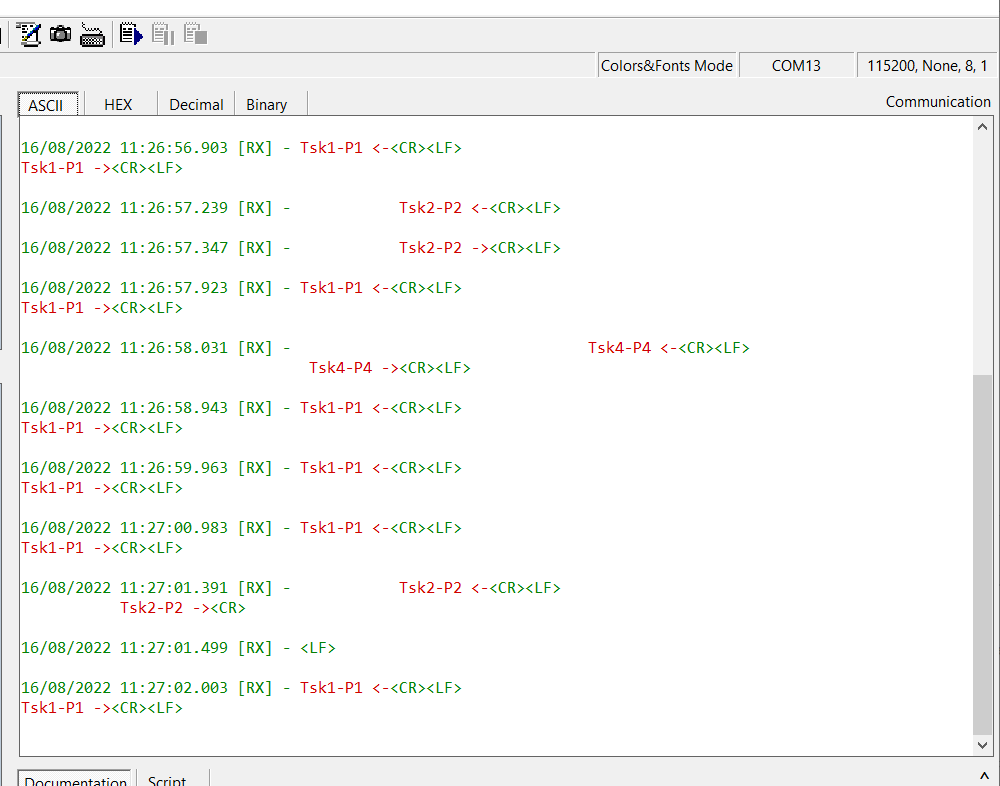
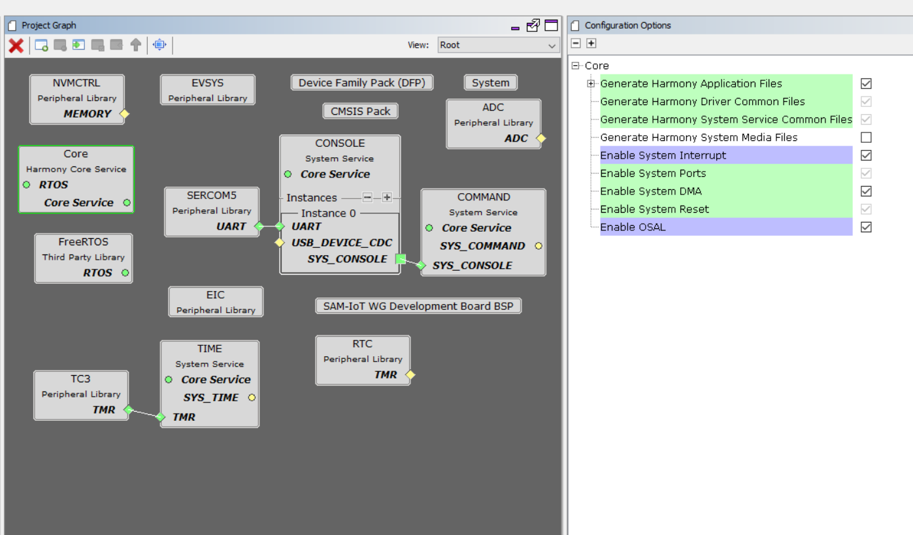

# samd21_basic_freertos

This simple demo featuring ARM CORTEX M0+ implementing FreeRTOS with Semophore Binary Mutex.

Environment:
1. MPLABX IDE V6.0
2. XC32 V3.0
3. MPLAB Harmony V3
4. SAM-IOT WG (Board)

# Output:

# MH3 Config:

